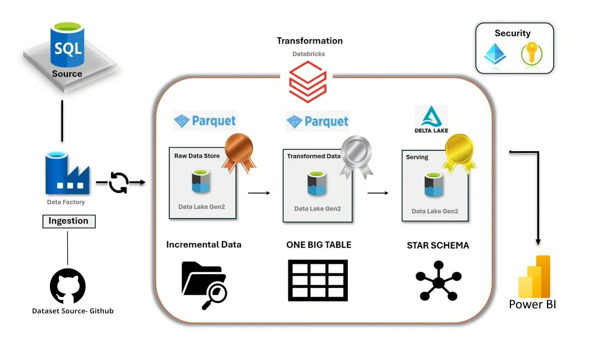
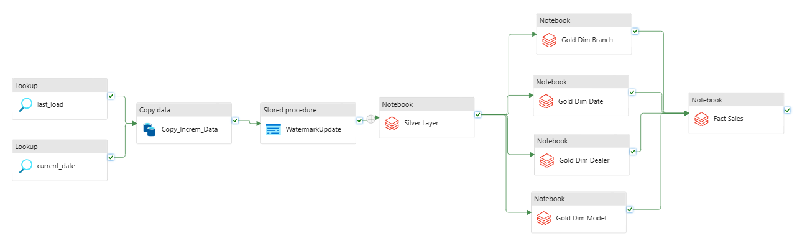
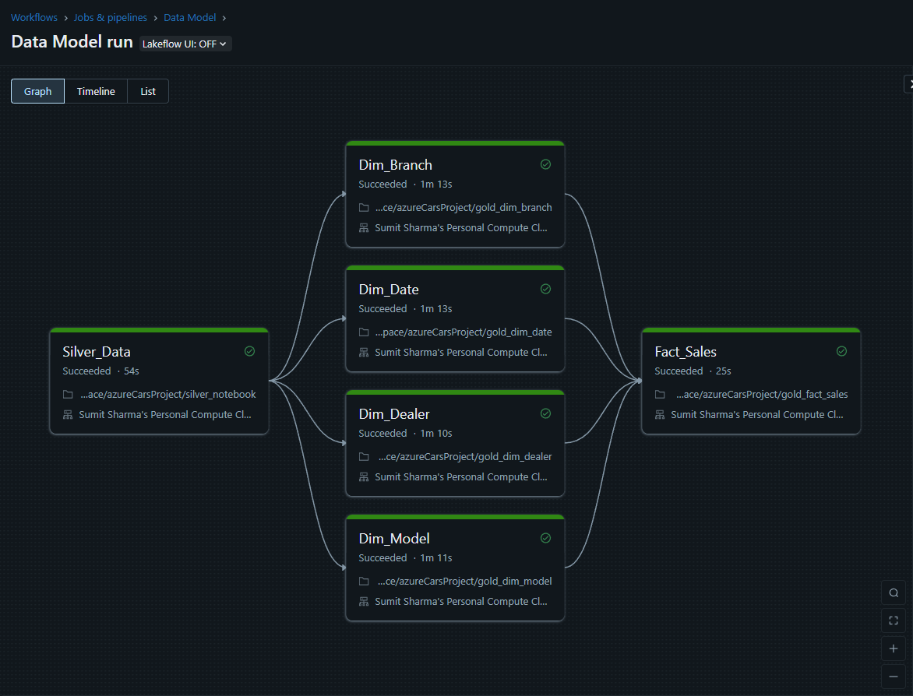
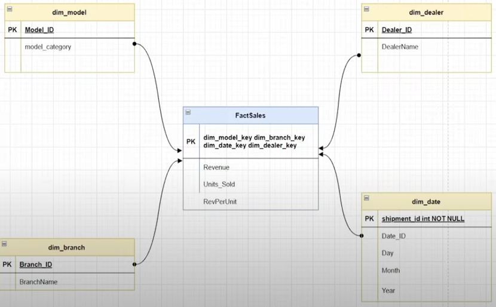
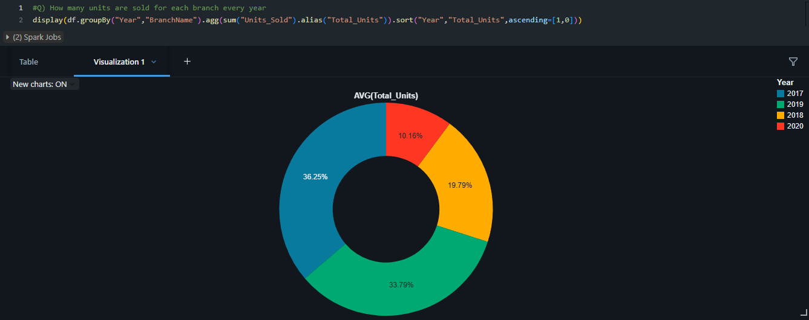

# Azure End-to-End Data Pipeline

A complete data pipeline using Azure services like ADF, Databricks, Delta Lake, and SQL-based Star Schema.

## Features

- Medallion Architecture (Bronze → Silver → Gold)
- Delta Lake + Unity Catalog
- SCD Implementation (Type 1)
- Star Schema Modeling
- Parameterized & Scalable ADF Pipelines

## Technologies

- Azure Data Factory
- Azure Databricks (PySpark)
- Delta Lake
- Azure SQL
- Power BI (optional)

## Run Instructions

1. Clone this repo
2. Run ADF pipelines → Bronze
3. Process with Databricks → Silver → Gold
4. Validate SQL warehouse output

